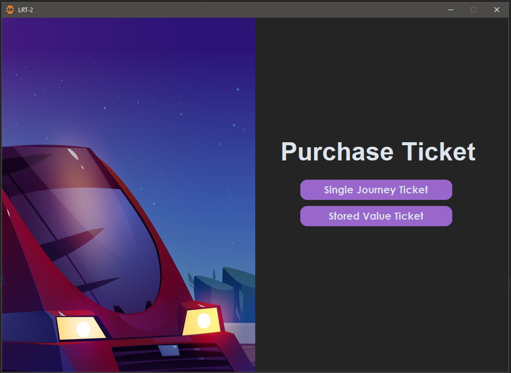
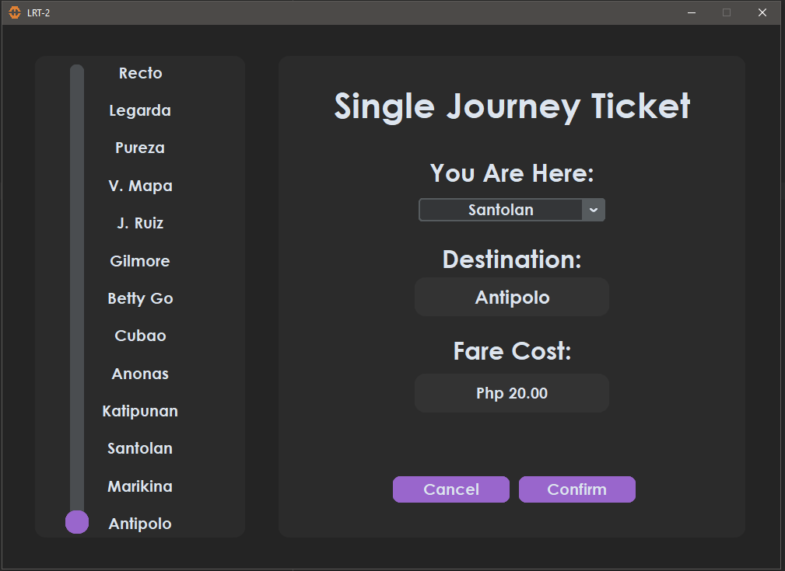
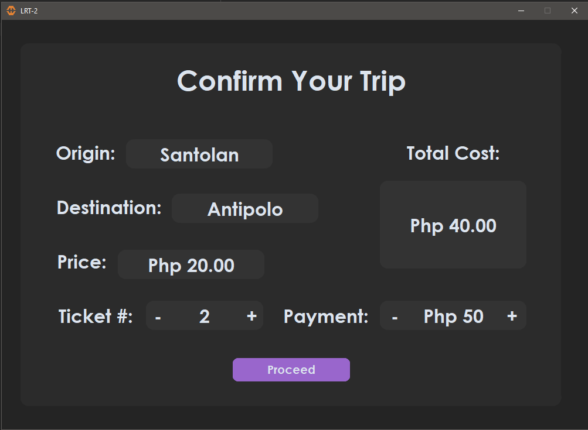
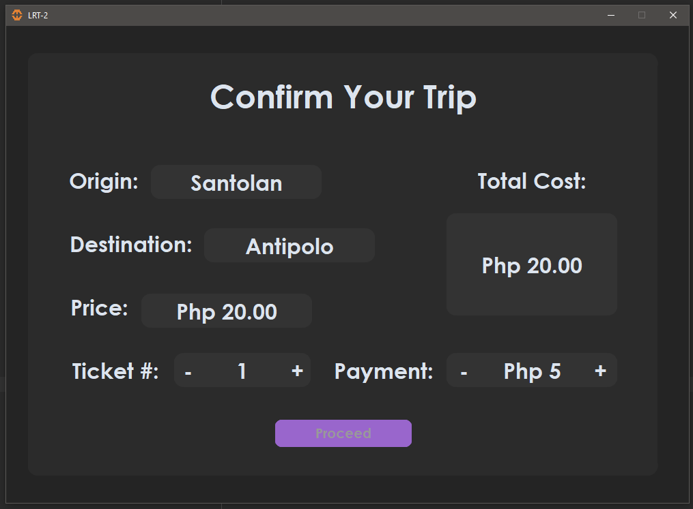
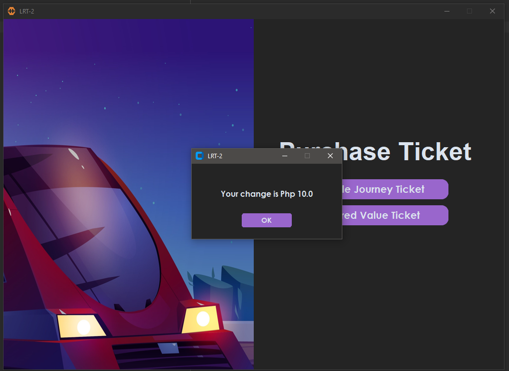
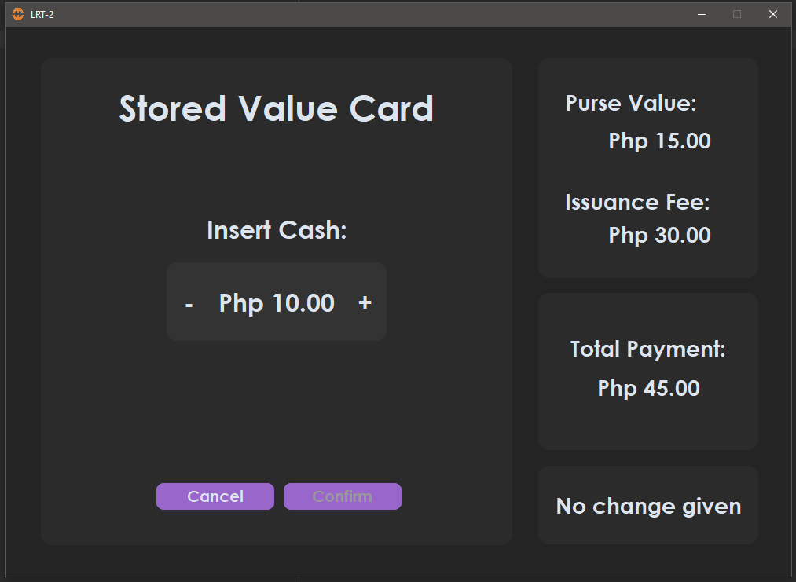
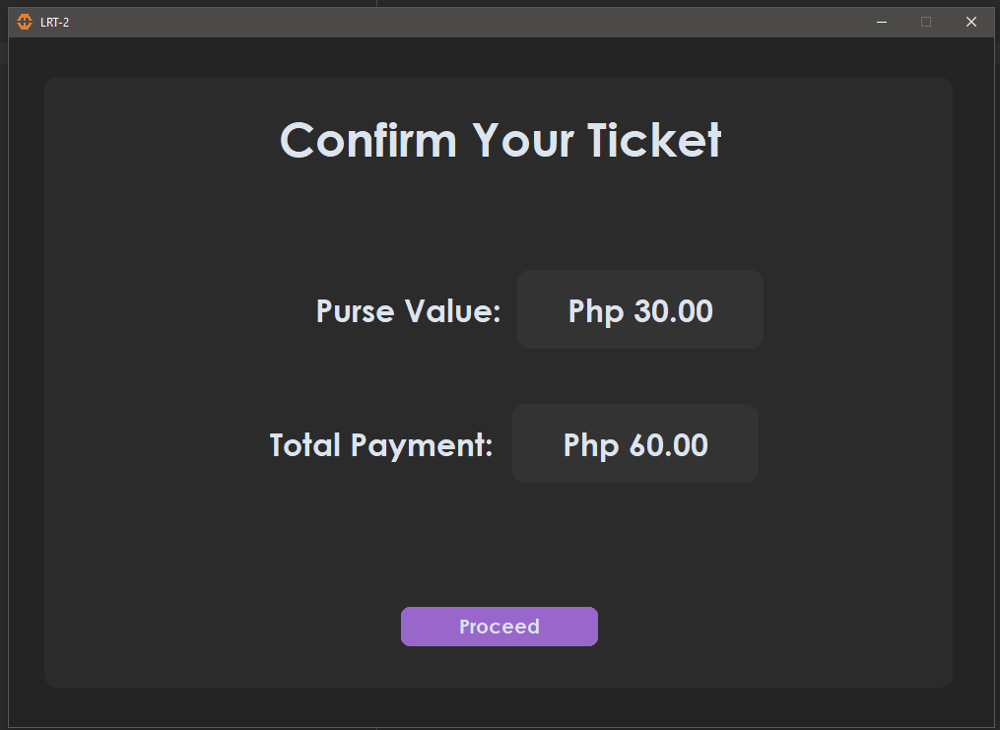
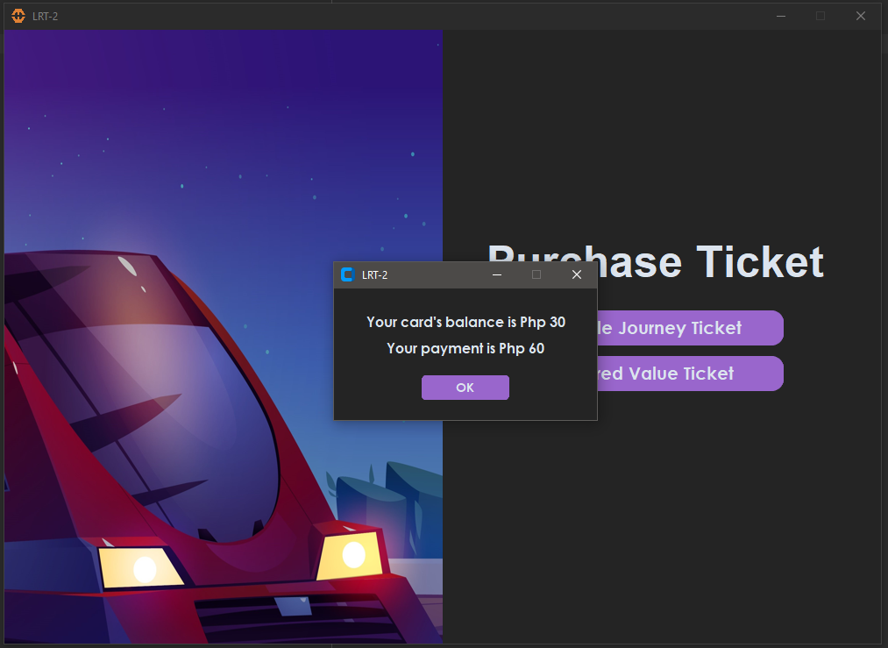

# RECREATING A SIMULATION OF LRT-2 TICKET VENDING MACHINE GUI

**I am currently working on making the code cleaner**

A project I created to challenge myself in creating an application using Python and SQLite.

During my sophomore year in college, we were tasked with creating a program that calculates LRT-2's fare matrix. 
Since then, I promised myself that I would one day code an application to simulate LRT-2's ticket vending machine.

This project uses Python's Custom Tkinter library to build its modern and minimalistic GUI. 
Custom Tkinter enhances the standard Tkinter library, enabling users to create more modern-looking UIs.

The project uses SQLite for its database, with Python utilized to manipulate the data.

## THE PROJECT

### The application's homepage

### This is where you buy a Single Journey Ticket where there is a dropdown menu for you to choose your place of origin and a slider to simulate the railway transit's map and destination selector

### After selecting your origin and destination, users can now see the summary of their transaction where they can choose how many tickets they will buy and insert their payment

### If the user's payment is less than the total cost, the "Proceed" button will be disabled

### If the payment exceeds the total cost, you will be notified by a pop-up window and receive your change.

### This is where you can purchase a Stored Value Card (Beep Card), allowing you to insert money and add value to the card.

### If the user's payment is less than the total cost, the "Proceed" button will be disabled

### After confirming your purchase you will be able to view the summary 

## DONE!
